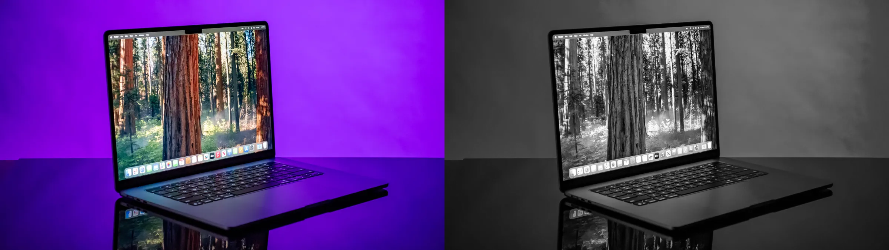
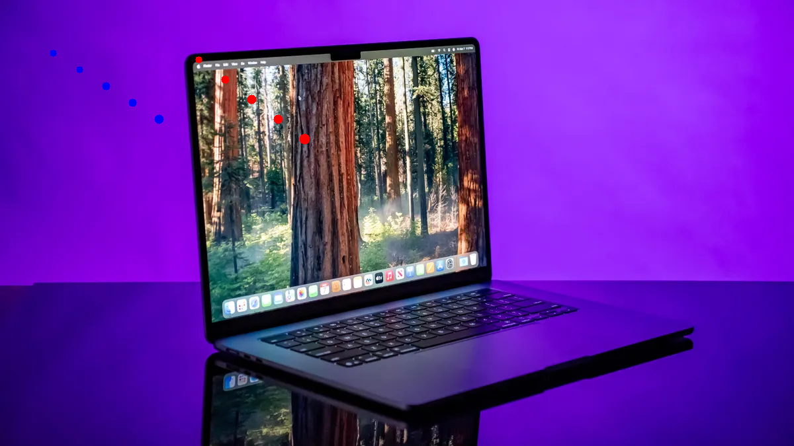
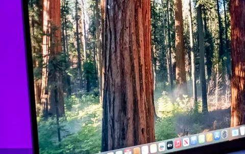

# Lecture 01

## 1. 문제 정의
Lecture 01의 목표는 OpenCV의 기본 입출력/이벤트 처리 기능을 사용해 다음 3개 기능을 구현하는 것이다.

- `e1.py`: 입력 이미지를 로드하고 grayscale 변환 결과를 원본과 함께 출력
- `e2.py`: 마우스 기반 페인팅(좌/우 클릭 색상 구분, 드래그 연속 그리기, 붓 크기 조절)
- `e3.py`: 마우스 드래그로 ROI 선택, 추출 표시, 저장

## 2. 문제 해결 메소드
- `e1.py` 해결 방법
  - 입력 인자 검증 후 `cv.imread()` 실패를 예외 처리해 실행 안정성을 확보했다.
  - grayscale은 1채널이므로 원본(BGR 3채널)과 바로 붙일 수 없다. 따라서 `cv.COLOR_GRAY2BGR`로 채널 수를 맞춘 뒤 `np.hstack()`로 결합했다.
  - 화면 확인은 `cv.imshow()`와 `cv.waitKey(0)`로 구현해 키 입력까지 유지되도록 했다.
- `e2.py` 해결 방법
  - `Painter` 클래스로 상태(캔버스, 붓 크기)를 캡슐화해 이벤트 처리 로직을 분리했다.
  - `cv.setMouseCallback()`에서 클릭 이벤트와 이동 이벤트를 분기해 "단일 점 찍기 + 드래그 연속 그리기"를 모두 충족했다.
  - 붓 크기 변경 시 `_clamp_brush()`를 통해 범위를 `1~15`로 강제해 요구조건을 일관되게 만족시켰다.
- `e3.py` 해결 방법
  - `RoiSelector` 클래스에서 시작점/끝점/선택중 여부를 관리해 드래그 기반 ROI 선택을 구현했다.
  - 드래그 중에는 매 프레임 원본 복사본 위에 사각형을 그려 실시간 시각화를 제공했다.
  - 버튼 해제 시 좌표를 `min/max`로 정규화해 드래그 방향과 무관하게 ROI를 안정적으로 추출했다.
  - `r/s/q` 키 입력을 메인 루프에서 처리해 리셋, 저장, 종료 동작을 분리했다.

## 3. 실제 코드
실제 제출 코드는 `e1.py`, `e2.py`, `e3.py`이며, 아래는 문제별 핵심 코드이다.

### e1.py 핵심 코드
```python
img_bgr = cv.imread(str(image_path))
img_gray = cv.cvtColor(img_bgr, cv.COLOR_BGR2GRAY)
img_gray_bgr = cv.cvtColor(img_gray, cv.COLOR_GRAY2BGR)
merged = np.hstack([img_bgr, img_gray_bgr])

cv.imshow("Original | Grayscale", merged)
cv.waitKey(0)
cv.destroyAllWindows()
```

### e2.py 핵심 코드
```python
def on_mouse(self, event: int, x: int, y: int, flags: int, param) -> None:
    if event == cv.EVENT_LBUTTONDOWN:
        self._draw(x, y, (255, 0, 0))  # Blue
        return
    if event == cv.EVENT_RBUTTONDOWN:
        self._draw(x, y, (0, 0, 255))  # Red
        return
    if event == cv.EVENT_MOUSEMOVE:
        if flags & cv.EVENT_FLAG_LBUTTON:
            self._draw(x, y, (255, 0, 0))
        elif flags & cv.EVENT_FLAG_RBUTTON:
            self._draw(x, y, (0, 0, 255))
```

```python
if key in (ord("+"), ord("=")):
    painter.brush_size += 1
    painter._clamp_brush()  # 1~15 유지

if key in (ord("-"), ord("_")):
    painter.brush_size -= 1
    painter._clamp_brush()
```

### e3.py 핵심 코드
```python
if event == cv.EVENT_LBUTTONDOWN:
    self.selecting = True
    self.start_xy = (x, y)
    self.end_xy = (x, y)

if event == cv.EVENT_MOUSEMOVE and self.selecting:
    self.end_xy = (x, y)
    self._update_display_rectangle()

if event == cv.EVENT_LBUTTONUP and self.selecting:
    self.selecting = False
    self.end_xy = (x, y)
    self._finalize_roi()
```

```python
x_min, x_max = sorted([x0, x1])
y_min, y_max = sorted([y0, y1])
self.roi = self.image[y_min:y_max, x_min:x_max].copy()
cv.imshow("ROI", self.roi)
```

실행 예시:

```bash
python lecture01/e1.py <image_path>
python lecture01/e2.py <image_path>
python lecture01/e3.py <image_path>
```

## 4. 실행 결과
- `e1.py`: 원본 이미지와 grayscale 변환 이미지가 좌우로 나란히 표시됨
- `e2.py`: 마우스 클릭/드래그로 캔버스에 실시간 페인팅되며, `+`/`-` 키로 붓 두께가 변경됨
- `e3.py`: 드래그한 사각형 ROI가 별도 창에 표시되고 `s` 입력 시 `roi_saved.png`로 저장됨

결과 파일은 `lecture01/results`에 저장했다.

### e1 결과 (Original + Grayscale)


### e2 결과 (Paint)


### e3 결과 (ROI 선택 미리보기)


### e3 결과 (저장된 ROI)


## 5. 논의
요구사항을 어떻게 만족했는지 기능 단위로 정리하면 다음과 같다.

- `e1.py`
  - 이미지 로드 요구사항: `cv.imread()` 사용 + `None` 체크로 실패 케이스 처리.
  - grayscale 변환 요구사항: `cv.COLOR_BGR2GRAY`를 정확히 사용.
  - 원본/결과 동시 표시 요구사항: grayscale을 BGR로 변환 후 `np.hstack()`로 결합해 한 화면에서 비교 가능.
  - 종료 요구사항: `cv.waitKey(0)`로 사용자 입력 대기 후 `cv.destroyAllWindows()` 호출.
- `e2.py`
  - 초기 붓 크기 5 요구사항: `self.brush_size = 5`로 초기화.
  - `+/-` 조절 요구사항: 키 입력마다 증감하고 `_clamp_brush()`로 `1~15` 범위 보장.
  - 좌클릭 파란색/우클릭 빨간색 요구사항: 이벤트별 BGR 색상 분기 처리.
  - 드래그 연속 그리기 요구사항: `EVENT_MOUSEMOVE` + 버튼 플래그(`EVENT_FLAG_LBUTTON`, `EVENT_FLAG_RBUTTON`)로 연속 원 그리기.
  - 종료 요구사항: 메인 루프에서 `q` 처리.
- `e3.py`
  - ROI 드래그 선택 요구사항: `LBUTTONDOWN/MOUSEMOVE/LBUTTONUP` 3단계 상태 전이로 구현.
  - 드래그 시 사각형 시각화 요구사항: `_update_display_rectangle()`에서 `cv.rectangle()`로 실시간 표시.
  - ROI 추출/출력 요구사항: 버튼 해제 시 좌표 정규화 후 numpy 슬라이싱으로 ROI 생성, `cv.imshow("ROI", ...)`로 표시.
  - 리셋/저장/종료 요구사항: `r`(초기화), `s`(`cv.imwrite` 저장), `q`(종료) 각각 구현.

정리하면, 각 파일은 제시된 OpenCV 함수 사용 조건과 인터랙션 조건(키보드/마우스)을 모두 충족하도록 구성했다.
